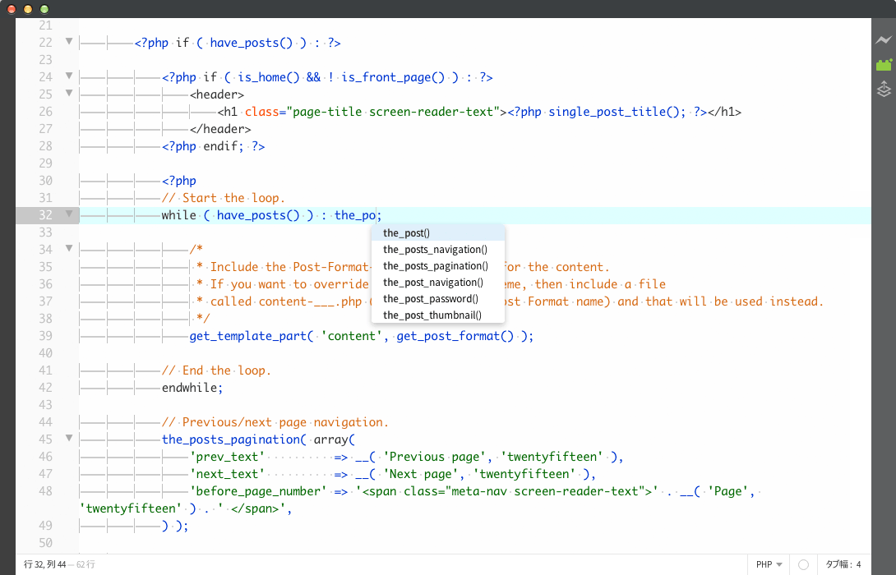

brackets-wp-functions-hints
===========================

Brackets WordPress Functions Hints - Provides code hints for function for the WordPress Themes and/or Plugins.

Screenshot
----------

How to Install
--------------
1.	Open `File` > `Extension Manager`.
2.	Select `Available` Tab.
3.	Search for `Brackets WordPress Functions Hints`.
4.	Install.

OR

Clone this repository in your extensions directory.

Reference
--------------
WordPress Code Reference / [Functions](https://developer.wordpress.org/reference/functions/)

Changelog
--------------
Ver 1.0.0
* Initial release.
* Add function of up to WordPress 4.1
* Remove function of deprecated

Copyright and License
--------------
Copyright (c) 2015 [Mignon Style](http://mignonstyle.com/). Released under the [MIT License](LICENSE).